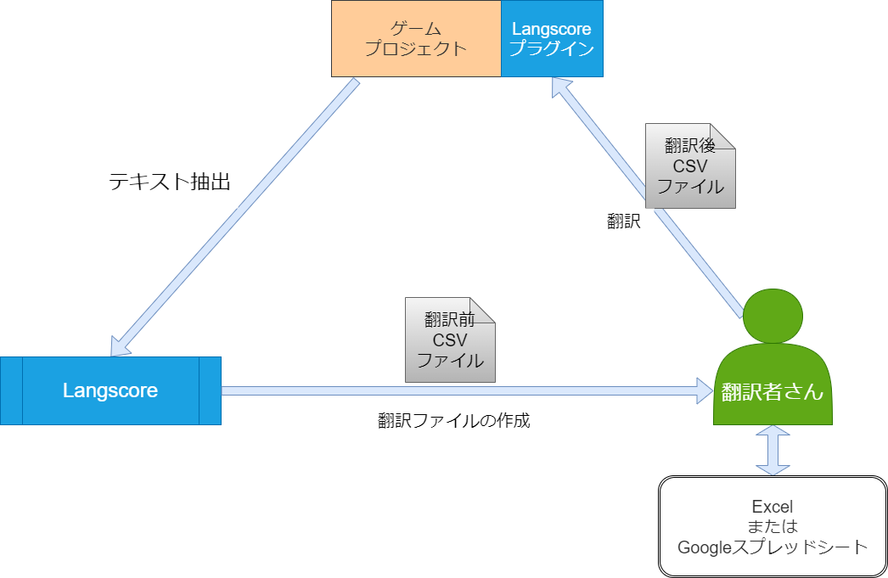

# ワークフロー {#workflow}

翻訳を組み込むまでの手順として、以下のような流れが考えられます。

1. ゲーム制作者がLangscoreを使用して翻訳ファイルを作成
2. 翻訳作業者に翻訳ファイルを渡して翻訳を依頼
3. 翻訳済みのファイルを受け取り、ゲームに組み込む

また、開発チーム内に翻訳担当者がいる場合は、翻訳者がプロジェクトから直接翻訳ファイルを作成するケースも考えられます。

CSVファイルをOffice360やGoogleスプレッドシートに上げることで、共同作業等も可能です。